# A little bit of Features

## What happen if turns out the workload is too much?

Kubernetes have this feature called:

```mermaid
graph TB
    %% Styles
    classDef base fill:transparent,stroke:#fff,stroke-width:1px,color:#fff
    classDef stress fill:transparent,stroke:#ff6b6b,stroke-width:2px,color:#ff6b6b
    classDef success fill:transparent,stroke:#4ade80,stroke-width:2px,color:#4ade80
    classDef sub fill:transparent,stroke:#444,stroke-width:1px,color:#fff

    %% Horizontal Pod Autoscaling
    subgraph HPA [Horizontal Pod Autoscaling]
        direction TB
        subgraph HPA_Before [" "]
            P1("🔥 Pod (Overloaded)"):::stress
        end
        
        P1 ===>|Scale Out| P2 & P3 & P4

        subgraph HPA_After [" "]
            direction LR
            P2("✅ Pod 1"):::success
            P3("✅ Pod 2"):::success
            P4("✅ Pod 3"):::success
        end
    end

    %% Vertical Pod Autoscaling
    subgraph VPA [Vertical Pod Autoscaling]
        direction TB
        subgraph VPA_Before [" "]
            P5("⚠️ Small Pod"):::stress
        end
        
        P5 ===>|Scale Up| P6

        subgraph VPA_After [" "]
            P6("💪 LARGE POD"):::success
        end
    end
    
    %% Apply Subgraph Styles
    class HPA,HPA_Before,HPA_After,VPA,VPA_Before,VPA_After sub
    
    %% Link Styling
    linkStyle default stroke:#666,stroke-width:2px,color:#888
```

1.  <strong>Vertical Pod Autoscaling (VPA)</strong> can help us scale the resources (CPU and memory) of each pod based on the workload.
2.  <strong>Horizontal Pod Autoscaling (HPA)</strong> which can help us scale the number of pods (instances of our application) up or down based on the workload. 



# Deep Dive: Horizontal Pod Autoscaling (HPA)

**Horizontal Pod Autoscaling (HPA)** is like calling for backup. When your application is getting overwhelmed by traffic, HPA automatically deploys more identical copies (pods) of your application to share the load. When the traffic dies down, it dismisses the extra pods to save resources.

## How it works
HPA monitors specific metrics (like CPU usage or custom metrics like request rate). It periodically checks these metrics against the target value you've set.

1.  **Monitor**: The Metrics Server collects resource usage data from each pod.
2.  **Calculate**: HPA calculates the desired number of replicas using a formula:
    ```math
    desiredReplicas = ⌈ currentReplicas × (currentMetricValue / desiredMetricValue) ⌉
    ```
3.  **Scale**: If the calculation shows a need for more or fewer pods, HPA updates the deployment to scale the replica count.

## When to use it
- **Stateless Applications**: Web servers, API gateways, and microservices that don't store data locally are perfect candidates.
- **Variable Traffic**: Applications that see spikes during the day and lulls at night.

# Deep Dive: Vertical Pod Autoscaling (VPA)

**Vertical Pod Autoscaling (VPA)** is like giving your existing worker steroids (or a diet plan). Instead of adding *more* workers, VPA makes the *existing* workers stronger by giving them more CPU and Memory.

## How it works
VPA consists of three main components:
1.  **Recommender**: It watches the history of resource usage and recommends the ideal CPU and memory requests.
2.  **Updater**: It decides which pods need to be restarted to apply the new resource limits.
3.  **Admission Controller**: When a pod is created (or recreated), it intercepts the creation request and overrides the resource requests with the recommended values.

## Key Considerations
- **Restart Required**: To change the CPU/Memory of a running pod, Kubernetes usually needs to restart it. This can cause brief interruptions if not managed carefully.
- **Stateful Workloads**: VPA is often better for databases or legacy applications that are hard to scale horizontally (difficult to run multiple copies of).
- **Don't mix with HPA on CPU/Memory**: Using HPA and VPA together on the same metric (e.g., CPU) can lead to a conflict where they fight each other. (e.g., HPA adds pods because CPU is high, while VPA tries to make pods larger).

# Summary: Which one should I use?

<table>
  <thead>
    <tr>
      <th>Feature</th>
      <th>Best For...</th>
      <th>Pros</th>
      <th>Cons</th>
    </tr>
  </thead>
  <tbody>
    <tr>
      <td><strong>HPA</strong></td>
      <td>Handling traffic spikes in stateless apps</td>
      <td>Responsive scaling; High Availability</td>
      <td>Potential cold starts; Complex for stateful apps</td>
    </tr>
    <tr>
      <td><strong>VPA</strong></td>
      <td>Optimizing resource usage for heavy tasks</td>
      <td>Efficient resource utilization; Good for legacy apps</td>
      <td>Requires pod restart; Slower reaction to spikes</td>
    </tr>
  </tbody>
</table>
