# What is Kubernetes?
Kubernetes is an open-source platform designed to manage, deploy, and scale containerized applications automatically. It helps developers and operations teams run applications across clusters of servers by handling tasks such as container scheduling, load balancing, scaling, and self-healing when failures occur. Instead of managing individual servers or containers manually, Kubernetes ensures that applications are always running in their desired state, making systems more reliable, scalable, and easier to maintain, especially in modern cloud and microservices environments.

[Check out the official Kubernetes documentation](https://kubernetes.io/docs/home/)

```mermaid
graph LR
    %% Styles
    classDef base fill:transparent,stroke:#fff,stroke-width:1px,color:#fff
    classDef person fill:transparent,stroke:#64b5f6,stroke-width:2px,color:#64b5f6
    classDef staff fill:transparent,stroke:#ffb74d,stroke-width:2px,color:#ffb74d

    A("👤 Customer"):::person ===>|&nbsp; Orders Dish &nbsp;| B("💁 Server"):::staff
    B ===>|&nbsp; Passes Order &nbsp;| C("👨‍🍳 Chef"):::staff
    C ===>|&nbsp; Prepares Dish &nbsp;| B
    B ===>|&nbsp; Serves Customer &nbsp;| A
    
    %% Link Styling
    linkStyle default stroke:#666,stroke-width:2px,color:#888
```

# Can you explain it in simpler terms, Mr. Alien? 😔 
Imagine you are running a restaurant. You have a team of chefs who are responsible for cooking the food. You also have a team of server who are responsible for taking orders and serving the customers. And you know the flow of a restaurant is as follows: &nbsp;<em>A customer comes in and orders a dish → The server takes the order and passes it to the chef → The chef prepares the dish and passes it back to the server → The server then serves the customer.</em> <strong>You might already know what this refering to.</strong> 😉

Now, let's talk about what might happen in the restaurant:
1. <strong>What happen if turns out the workload is too much?</strong> 
    <em>You need to hire more chefs and server to handle the workload. Or maybe you can increase the resources while keeping the existing number of chef and server to handle the workload like upgrading the kitchen equipment or adding a digital ordering system.</em>
2. <strong>If you indeed hire a new staff, how do you ensure the new staff is trained and ready to work?</strong> 
    <em>You need to provide a clear Standard Operating Procedures (SOP) and guidance for the new staff to follow.</em>
3. <strong>What happen if the chef or the server is sick?</strong> 
    <em>You need to find a replacement as soon as possible. So the restaurant can continue to serve the customers.</em>
4. <strong>How do you manage the storage for the ingredients in the restaurant?</strong> 
    <em>You need a clear storage system to store the ingredients. like which ingredients can be stored in the fridge, which ingredients can be stored in the pantry, and which ingredients can be stored in the warehouse. And also how the ingredients flow need to be as efficient as possible.</em>

Wouldn't it be great if you have a manager who can help you solve the problem we've talked above? The manager can help you coordinate the chefs and server, ensure the new hire and even the existing crew now what they need to do, and help manage the storage in the restaurant. 

**Now please welcome the manager of the restaurant, Kubernetes!**

